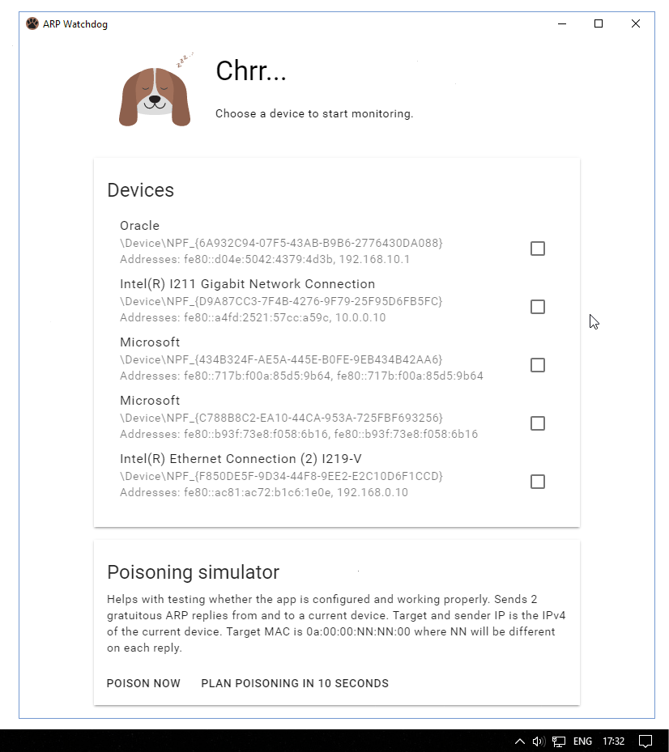

# ARP Watchdog

Non-serious project. Not intended for use in the real world.



## Features
* ARP poisoning watching on the wanted interface
* Hiding to tray with native notifications
* Poisoning simulation
* Configuration support

## Downloads
* [Windows x64](https://github.com/durasj/arp-watchdog/releases/download/v0.1.0/ARPWD-0.1.0-win.x64.zip) - tested on Windows 10, wired LAN
* Ready to be built for other platforms as well

## Configuration

Configuration can be done using config.json:
* `./resources/app.asar.unpacked/config.json` in the packed format
* `./package.json` during development

| Name                        | Description        | Default |
| --------------------------- | ------------------ | ------- |
| ENABLE_DEBUG                | Enable debuging<br>Developer tools can be opened using Ctrl+Shift+I |  `false` |
| ENABLE_DEBUG_LOGGING        | Enable logging to console |  `true` |
| ENABLE_DEBUG_VERBOSE        | Enable verbose logging |  `false` |

## Development

**Requirements**:
* Node.js v6 LTS + NPM
* Windows for win32 packaging
* For Windows: [WinPcap](http://www.winpcap.org/install/default.htm)
* For *nix: libpcap and libpcap-dev/libpcap-devel packages

Clone this repository and install dependencies:

```
git clone https://github.com/durasj/arp-watchdog.git
cd arp-watchdog
npm install
npm start
```

After file changes, run `npm start`. The project should be built and the app opened.
For 64-bit win32 and linux folder packaging, run `npm package`
To create 64-bit win32 and linux installable, run `npm dist`

See [package.json](package.json) for more available commands

### Kudos to

* [Electron](https://electron.atom.io/) ([Node](https://nodejs.org/) and [Chromium](https://www.chromium.org/))
* [Cap](https://github.com/mscdex/cap) ([libpcap](http://www.tcpdump.org/))
* [Typescript](https://www.typescriptlang.org/)
* [React](https://facebook.github.io/react/)
* [Material components](https://github.com/material-components/material-components-web)
* ... and others, see [package.json](package.json)

### Code structure

Directory `./src` contains raw source code. Directory `./build` compiled/copied source code ready to be used by Electron.

File `./main.js` is processed as first by Electron to bootstrap the application by creating the main window with `./build/index.html`, which loads some ui dependencies and `index.js`, `index.css`.
